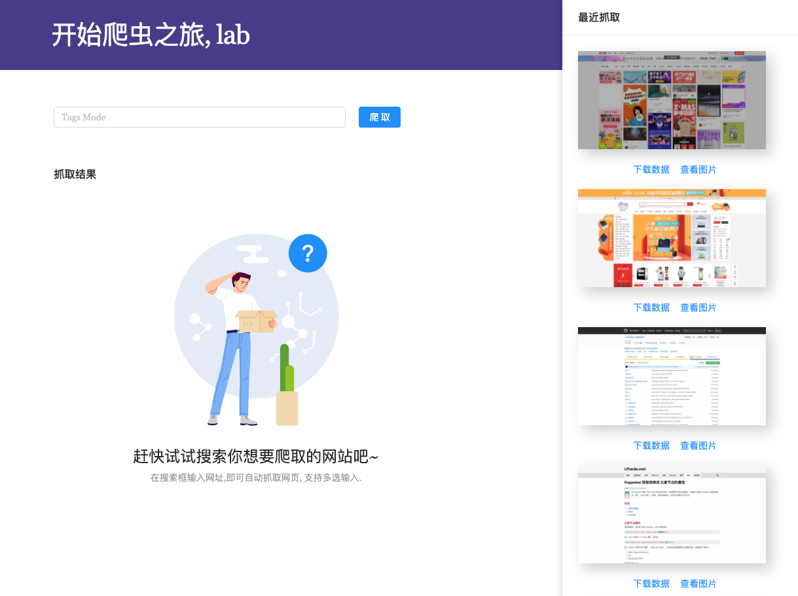
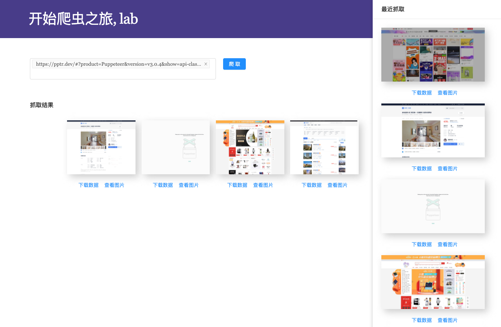

## 基于Apify+node+react搭建的有点意思的爬虫平台
> 该平台可以用来爬取任意网页的数据, 网页全屏截图(网页快照), 并对爬取到的数据进行管理, 操作等.开发者也可以自行进行扩展, 作为爬虫管理平台的基础服务.

## 技术实现
* 前端采用umi集成开发环境, 框架选用react+antd;
* 后端采用nodejs + koa, 爬虫框架采用Apify;
* node多进程开发模式

## 项目截图

## 开源交流与反馈
